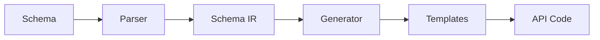

# Introduction to OpenGenerator

OpenGenerator is a powerful schema-to-API code generator that transforms your data schemas into production-ready APIs. Whether you're building a simple REST API or a complex microservices architecture, OpenGenerator helps you ship faster with less boilerplate.

## What is OpenGenerator?

OpenGenerator is a CLI tool and library that:

1. **Parses your schema** - Supports Prisma, OpenAPI, JSON Schema, Zod, TypeBox, and VLD
2. **Generates API code** - Creates REST, GraphQL, or tRPC endpoints
3. **Adds infrastructure** - Includes auth, validation, error handling, and deployment configs
4. **Maintains type safety** - Full TypeScript support from database to API

## Key Features

### 🔄 Schema-First Development

Start with your data schema and let OpenGenerator handle the rest:

```prisma
// prisma/schema.prisma
model User {
  id        String   @id @default(cuid())
  email     String   @unique
  name      String?
  posts     Post[]
  createdAt DateTime @default(now())
}

model Post {
  id        String   @id @default(cuid())
  title     String
  content   String?
  published Boolean  @default(false)
  authorId  String
  author    User     @relation(fields: [authorId], references: [id])
}
```

### 🚀 Multiple API Styles

Generate the API style that fits your needs:

- **REST** - Traditional RESTful endpoints with OpenAPI docs
- **GraphQL** - Schema, resolvers, and subscriptions
- **tRPC** - End-to-end type-safe APIs

### 🔧 Framework Agnostic

Switch frameworks without rewriting code:

- Express
- Fastify
- Hono
- Koa
- Standalone (zero dependencies)

### 🔐 Built-in Authentication

Multiple auth strategies out of the box:

- JWT tokens
- OAuth providers
- Session cookies
- API keys
- Magic links
- Passkeys (WebAuthn)

### 📦 Database Flexibility

Works with your preferred database solution:

- Prisma
- Drizzle
- Kysely
- TypeORM
- Mongoose
- Raw SQL

### ☁️ Deployment Ready

Generate deployment configs for:

- Docker
- Vercel
- Railway
- Fly.io
- AWS Lambda
- Kubernetes

## How It Works



1. **Parse** - Read your schema (Prisma, OpenAPI, etc.)
2. **Transform** - Convert to universal Schema IR
3. **Generate** - Apply templates for your chosen stack
4. **Output** - Write production-ready code

## Who Is It For?

OpenGenerator is perfect for:

- **Startups** - Ship MVPs faster without sacrificing quality
- **Teams** - Standardize API patterns across projects
- **Solo developers** - Reduce boilerplate and focus on features
- **Enterprises** - Maintain consistent architecture at scale

## Next Steps

Ready to get started?

1. [Quick Start Guide](/guides/quick-start/) - Create your first API
2. [Installation](/guides/installation/) - Detailed setup instructions
3. [Configuration](/guides/configuration/) - Customize your generator
